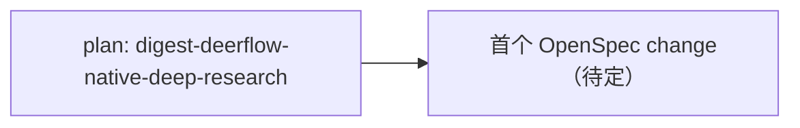

# Active Todos — 活跃 todo + 依赖链 + 执行顺序

> 最后更新: 2026-10-02（仓库起骨架日；活跃区为空） | `_backlog/todos/` — 活跃 todo 在此，做完移入 [`../_done/_done_todos/`](../_done/_done_todos/)。
>
> **本文件是所有活跃工作的中枢。** todo 没有编号，文件名即标识（`todo-<name>.md`）。完成后文件名不变，位置即状态。

## 完成一个 todo 的步骤

1. `git mv todos/todo-<name>.md _done/_done_todos/todo-<name>.md`
2. 更新 `_done/_done_todos/README.md`（加一行 + 更新 Next available DONE ID）
3. 更新本文件（删掉该 todo）
4. 更新 `../_done/README.md`（DONE 计数 +1）

**todo 和 bug 不同——todo 没有编号，只有 slug 名。命名权威是文件名本身。**

---

## 活跃列表

| # | 文件 | 优先级 | 简述 | 阻塞 / 备注 |
|---|------|--------|------|-------------|
| （无活跃 todo） | | | | |

---

## 已暂停的延期跟进

| 项 | 暂停原因 | 重启条件 |
| --- | --- | --- |
| — | — | — |

---

## 依赖链



---

## 推荐执行顺序

> 依赖链不等于优先级。这里给出**当前该按什么顺序做**，并一句话说明"为什么这个比那个更堵"。

| 顺序 | 项 | 为什么 |
|------|-----|--------|
| 1 | [`../plans/2026-10-02-digest-deerflow-native-deep-research.md`](../plans/2026-10-02-digest-deerflow-native-deep-research.md) | v3 一切实现方向都取决于"原生能力怎么用、harness 边界划在哪"这一个分析。 |

---

## 卡片模板

新建 todo 文件 `todo-<name>.md`（`<name>` 用 kebab-case slug，即标识）：

```markdown
# TODO: <name>

> 状态: 待设计 / 设计中 / 实施中 | 优先级: 高 / 中 / 低 | 更新: 2026-MM-DD
> 上游: <前置 todo/bug/plan> | 下游: <后续>

## Why
为什么要做——问题、痛点、现在做的理由。

## 现状对齐
把"旧期望 vs 现状"对齐，避免重做已落地的部分。

## Current Direction
当前打算怎么做（可含候选字段/接口草案）。

## Design Questions
悬而未决、需要先想清的关键设计问题。

## Non-Goals
明确不做什么，防止范围膨胀。

## Next Step
下一个具体动作（常是 `/opsx:explore <topic>` 起一个 OpenSpec change）。
```
